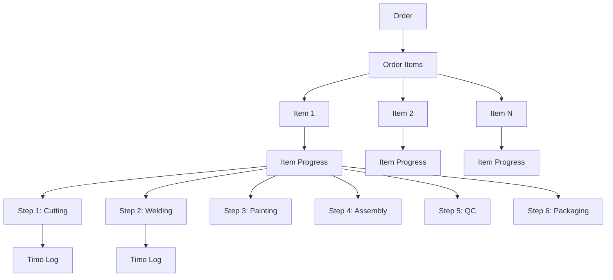

# Order Item Progress Tracking Architecture

## Overview

This plan outlines the changes needed to track assembly progress at the **order item level** instead of the order level. This allows each item in an order to be tracked independently through assembly steps.

## Key Decisions
- Rename `order_progress` to `item_progress`
- Update `step_time_logs` to reference `id_order_item`
- Add bulk operations for starting/completing steps
- Remove Assembly Line page
- Create Order Detail page with 2 tabs (General Info + Item Logs)

## Current State

```
order_progress table:
- id_progress (PK)
- id_order (FK) ← Progress tracked at ORDER level
- id_step (FK)
- started_at
- completed_at
- scanned_by
- barcode
- notes
- created_at
```

## Target State

```
item_progress table (renamed from order_progress):
- id_progress (PK)
- id_order_item (FK) ← Progress tracked at ITEM level
- id_step (FK)
- started_at
- completed_at
- scanned_by
- barcode
- notes
- created_at

step_time_logs table (updated):
- id_log (PK)
- id_order_item (FK) ← Changed from id_order
- id_step (FK)
- duration_seconds
- completed_at
```

## Database Migration

### Step 1: Create new item_progress table

```sql
-- Create new table
CREATE TABLE item_progress (
    id_progress UUID PRIMARY KEY DEFAULT gen_random_uuid(),
    id_order_item UUID NOT NULL REFERENCES order_items(id_order_item) ON DELETE CASCADE,
    id_step INTEGER NOT NULL REFERENCES assembly_steps(id_step),
    started_at TIMESTAMP WITH TIME ZONE,
    completed_at TIMESTAMP WITH TIME ZONE,
    scanned_by UUID,
    barcode VARCHAR(255),
    notes TEXT,
    created_at TIMESTAMP WITH TIME ZONE DEFAULT NOW(),
    UNIQUE(id_order_item, id_step)
);

-- Migrate existing data (if any)
INSERT INTO item_progress (id_progress, id_order_item, id_step, started_at, completed_at, scanned_by, barcode, notes, created_at)
SELECT op.id_progress, oi.id_order_item, op.id_step, op.started_at, op.completed_at, op.scanned_by, op.barcode, op.notes, op.created_at
FROM order_progress op
JOIN order_items oi ON op.id_order = oi.id_order;

-- Drop old table
DROP TABLE order_progress;

-- Update step_time_logs to reference item_progress
ALTER TABLE step_time_logs 
ADD COLUMN id_order_item UUID REFERENCES order_items(id_order_item);

UPDATE step_time_logs stl
SET id_order_item = ip.id_order_item
FROM item_progress ip
WHERE stl.id_order = ip.id_order_item; -- This needs proper join

-- Eventually remove id_order from step_time_logs
```

## Backend Changes

### 1. Entity Updates

**File:** `backend/api/src/routes/assembly/domain/entities/order_progress.entity.ts`

```typescript
// Rename to item_progress.entity.ts
export class ItemProgressEntity {
  public readonly id_progress: string;
  public readonly id_order_item: string;  // Changed from id_order
  public readonly id_step: number;
  public readonly started_at?: Date | null;
  public readonly completed_at?: Date | null;
  public readonly scanned_by?: string | null;
  public readonly barcode?: string | null;
  public readonly notes?: string | null;
  public readonly created_at: Date;
}
```

### 2. New Entity: Order Item with Progress

**File:** `backend/api/src/routes/order_items/domain/entities/order_item_with_progress.entity.ts`

```typescript
export class OrderItemWithProgressEntity {
  public readonly id_order_item: string;
  public readonly id_order: string;
  public readonly product_name: string;
  public readonly quantity: number;
  public readonly notes: string | null;
  public readonly current_step_id?: number | null;
  public readonly current_step_name?: string | null;
  public readonly current_step_status?: 'not_started' | 'in_progress' | 'completed';
  public readonly progress: ItemProgressEntity[];
  public readonly total_time_seconds?: number;
}
```

### 3. Data Source Updates

**File:** `backend/api/src/routes/assembly/data/datasources/remote/start_step.remote.datasource.ts`

```typescript
const START_STEP_QUERY = `
INSERT INTO item_progress (id_order_item, id_step, started_at, scanned_by, barcode, notes)
VALUES ($1, $2, NOW(), $3, $4, $5)
RETURNING *
`;
```

**File:** `backend/api/src/routes/assembly/data/datasources/remote/get_item_progress.remote.datasource.ts`

```typescript
const GET_ITEM_PROGRESS_QUERY = `
SELECT ip.*, s.step_name, s.step_order
FROM item_progress ip
JOIN assembly_steps s ON ip.id_step = s.id_step
WHERE ip.id_order_item = $1
ORDER BY s.step_order ASC
`;
```

### 4. New Data Source: Get Order Items with Progress

**File:** `backend/api/src/routes/orders/data/datasources/remote/get_order_items_with_progress.remote.datasource.ts`

```typescript
const GET_ORDER_ITEMS_WITH_PROGRESS = `
SELECT 
  oi.id_order_item,
  oi.id_order,
  oi.product_name,
  oi.quantity,
  oi.notes,
  -- Current step info
  current_step.id_step AS current_step_id,
  current_step.step_name AS current_step_name,
  CASE 
    WHEN current_ip.id_progress IS NULL THEN 'not_started'
    WHEN current_ip.completed_at IS NOT NULL THEN 'completed'
    ELSE 'in_progress'
  END AS current_step_status,
  -- Total time
  COALESCE(SUM(stl.duration_seconds), 0)::int AS total_time_seconds
FROM order_items oi
LEFT JOIN LATERAL (
  SELECT s.id_step, s.step_name, s.step_order
  FROM assembly_steps s
  LEFT JOIN item_progress ip ON s.id_step = ip.id_step AND ip.id_order_item = oi.id_order_item
  WHERE ip.completed_at IS NULL OR ip.id_progress IS NULL
  ORDER BY s.step_order ASC
  LIMIT 1
) current_step ON true
LEFT JOIN item_progress current_ip ON current_step.id_step = current_ip.id_step AND current_ip.id_order_item = oi.id_order_item
LEFT JOIN step_time_logs stl ON stl.id_order_item = oi.id_order_item
WHERE oi.id_order = $1
GROUP BY oi.id_order_item, current_step.id_step, current_step.step_name, current_ip.id_progress, current_ip.completed_at
ORDER BY oi.created_at ASC
`;
```

### 5. API Endpoints

| Method | Endpoint | Description |
|--------|----------|-------------|
| GET | `/api/orders/:id_order/items-with-progress` | Get all items with their progress |
| GET | `/api/order-items/:id_order_item/progress` | Get progress for single item |
| POST | `/api/assembly/start-step` | Start a step for an item |
| PATCH | `/api/assembly/complete-step/:id_progress` | Complete a step |

## Frontend Changes

### 1. Remove Assembly Page

Delete the following:
- `frontend/src/features/assembly/presentation/pages/Assembly.page.tsx`
- Related routes in `frontend/src/core/routes/routes.route.tsx`

### 2. New Page: Order Detail with Tabs

**File:** `frontend/src/features/orders/presentation/pages/OrderDetail.page.tsx`

**Tab 1: General Info**
- Order number
- Client name
- Order status
- Created date
- Notes
- Items summary (count, total quantity)

**Tab 2: Item Logs**
- List of all order items
- For each item show:
  - Product name
  - Quantity
  - Current step (with status badge: not_started/in_progress/completed)
  - Progress bar showing steps completed
  - Expandable history showing each step with:
    - Step name
    - Started at
    - Completed at
    - Duration (formatted as HH:MM:SS)
  - Action buttons:
    - Start next step
    - Complete current step

### 3. New Components

**File:** `frontend/src/features/order_items/presentation/components/ItemLogCard.component.tsx`

```typescript
interface Props {
  item: OrderItemWithProgressType;
  steps: AssemblyStepType[];
  onStartStep: (id_order_item: string, id_step: number) => void;
  onCompleteStep: (id_progress: string) => void;
  isExpanded: boolean;
  onToggle: () => void;
}
```

**File:** `frontend/src/features/order_items/presentation/components/StepHistory.component.tsx`

```typescript
interface Props {
  progress: ItemProgressType[];
  steps: AssemblyStepType[];
}
```

### 4. Updated Routes

Remove:
- `/assembly` route

Add:
- `/orders/:id` - Order Detail page

## Data Flow Diagram



## Implementation Order

1. **Database Migration**
   - Create item_progress table
   - Migrate existing data
   - Update step_time_logs

2. **Backend Updates**
   - Update entities
   - Update datasources
   - Update repositories
   - Update use cases
   - Update controllers

3. **Frontend Updates**
   - Update entities and schemas
   - Create Order Detail page
   - Update Assembly page
   - Add progress visualization

## Questions to Clarify

1. Should we keep historical progress data when migrating?
2. What happens to step_time_logs - should they also reference id_order_item?
3. Should there be a way to bulk-start steps for all items in an order?
